<div align="center">

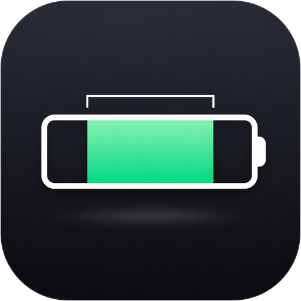

<h1 style="margin-bottom: 0.2em;">Battery Longer</h1>

<p style="font-size: 1.15em; color: #6b7280; max-width: 640px; margin: 0 auto;">
A macOS menu bar app that <strong>forces</strong> your MacBook battery to live between <strong>20 % and 80 %</strong>.<br/>
One warning. Two minutes. Then the screen locks until you fix it.
</p>

<p>


</p>

<p>


<a href="LICENSE"></a>
<a href="https://github.com/gurkanfikretgunak/battery-longer/releases"></a>
</p>

<p>
Built by <a href="https://github.com/gurkanfikretgunak"><strong>Gürkan Fikret Günak</strong></a> ·
<a href="https://github.com/MasterFabric"><strong>MasterFabric LLC</strong></a>
</p>

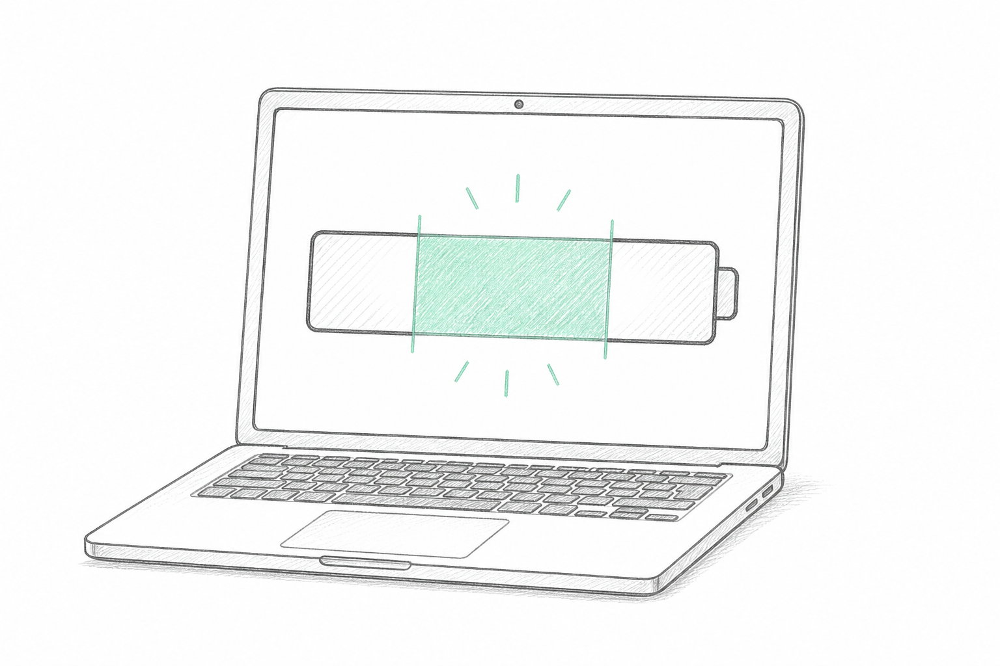

</div>

---

## Why

Lithium-ion cells age fastest at the extremes. Sitting at 100 % on the charger and draining to 0 % burns through their chemical lifespan. Batteries kept inside the 20–80 band deliver several times more charge cycles.

Reminders don't work; people dismiss them. **Battery Longer** doesn't remind. It enforces.

## How it works

| Step | What happens | When |
|------|--------------|------|
| **Deviation** | Plugged in and at the upper limit, **or** on battery and at the lower limit | instantly |
| **Warning · once** | Menu bar turns orange, a single notification + sound, the panel opens, a countdown starts | `2:00` |
| **Lock** | Still out of range? Every screen locks. Dock, menu bar and app switching are disabled | until fixed |
| **Resolved** | Unplug (or plug in) → the lock lifts by itself and the app says thanks | instantly |

There is **no snooze**, no "remind me later", no second warning. While locked, every ordinary quit path is refused; the only escape hatch is a deliberately slow 5-second hold on the lock screen that quits the app entirely.

### The rule, precisely

- **Overcharge**: adapter connected and level `> upper limit`, or `= upper limit` while still actively charging. macOS *Optimized Charging* holding at 80 % (no current flowing) is **not** a violation.
- **Deep discharge**: adapter disconnected and level `≤ lower limit`.
- Defaults: **20 – 80 %**, grace period **2:00**. Both are adjustable within a narrow band (see Settings). Nothing can enable snoozing.

### MacBook only

On launch the app inspects `IODeviceTree:/product` → `product-name`, `hw.model` and the presence of an internal battery. On an iMac / Mac mini / Mac Studio / Mac Pro it shows a single alert and quits.

## Screens

### Live app (1.0.2, dark mode)

<div align="center">

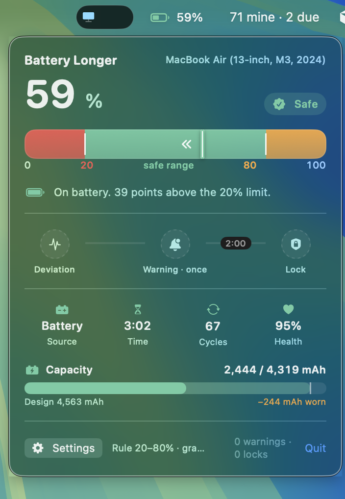
<br/><sub><strong>1 · Menu bar panel</strong> — live level, state pill, range gauge, enforcement timeline, battery stats and the mAh capacity bar</sub>

<br/><br/>

<table>
<tr>
<td align="center" width="33%">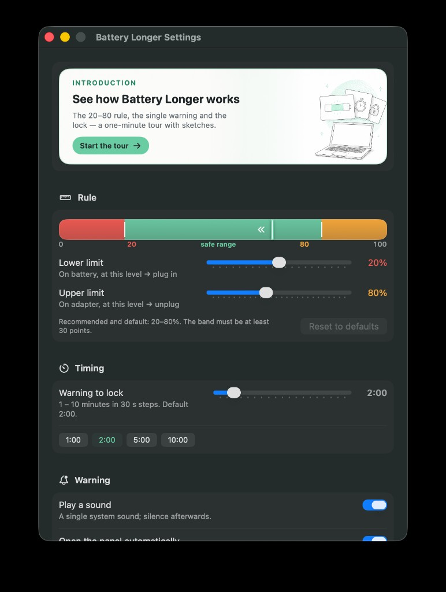<br/><sub><strong>2 · Settings — Rule &amp; Timing</strong><br/>introduction banner, live preview, limits, warning → lock</sub></td>
<td align="center" width="33%">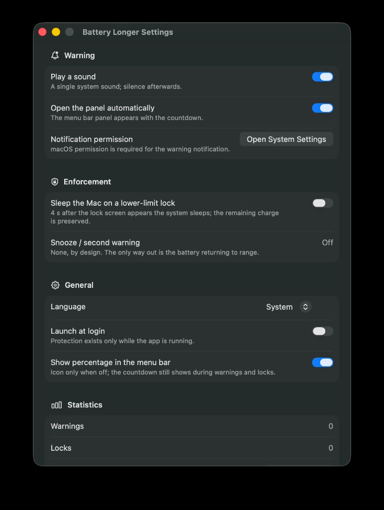<br/><sub><strong>3 · Settings — Warning, Enforcement &amp; General</strong><br/>sound, auto-open panel, sleep on lock, language, login item</sub></td>
<td align="center" width="33%">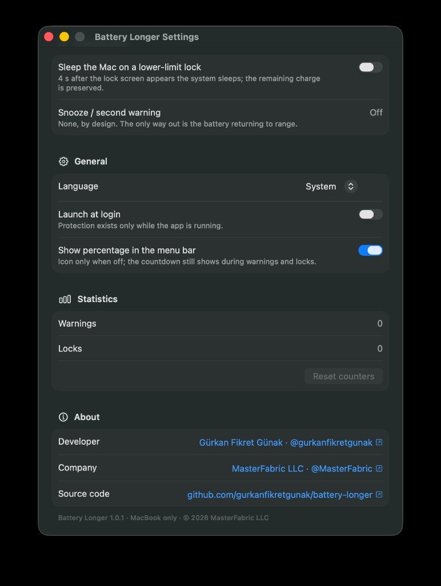<br/><sub><strong>4 · Settings — Statistics &amp; About</strong><br/>counters, developer / company / source links</sub></td>
</tr>
</table>

<br/>

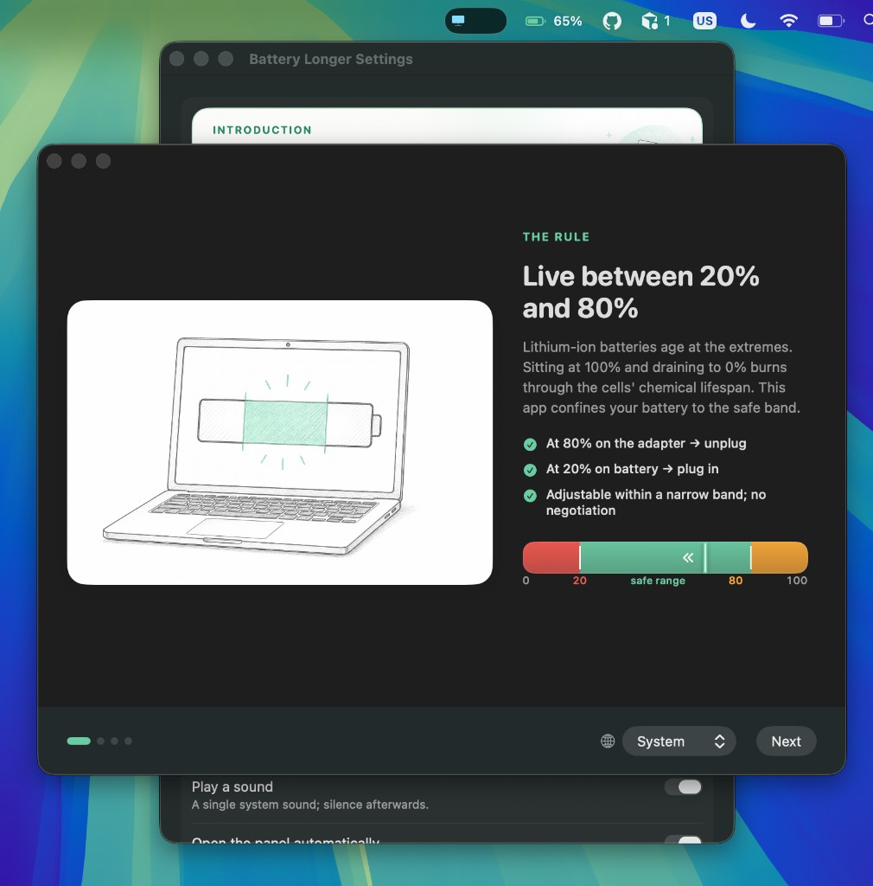
<br/><sub><strong>5 · Introduction tour</strong> — sketch on the left, the rule on the right, language switch in the footer</sub>

</div>

### Sketches

<div align="center">
<table>
<tr>
<td align="center" width="50%">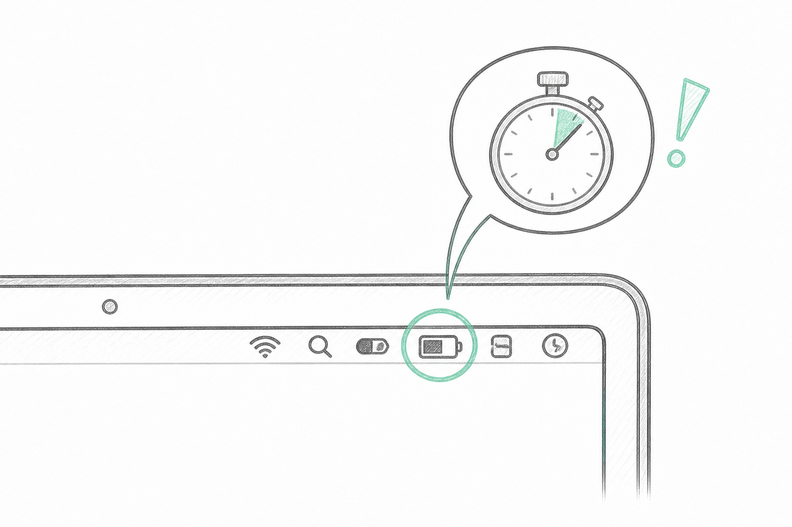<br/><sub><strong>One warning, two minutes</strong></sub></td>
<td align="center" width="50%">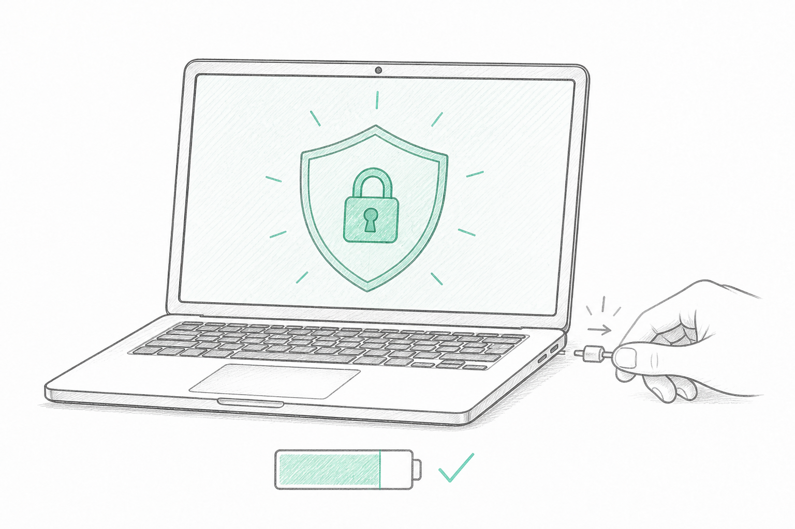<br/><sub><strong>Then it enforces</strong></sub></td>
</tr>
<tr>
<td align="center" width="50%">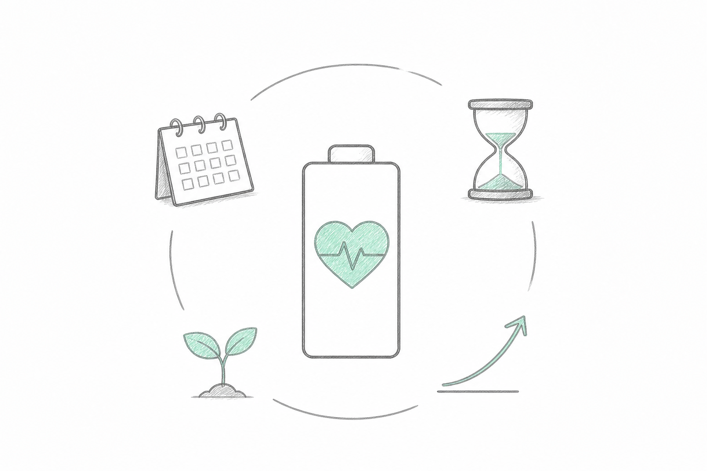<br/><sub><strong>Years of healthy battery</strong></sub></td>
<td align="center" width="50%">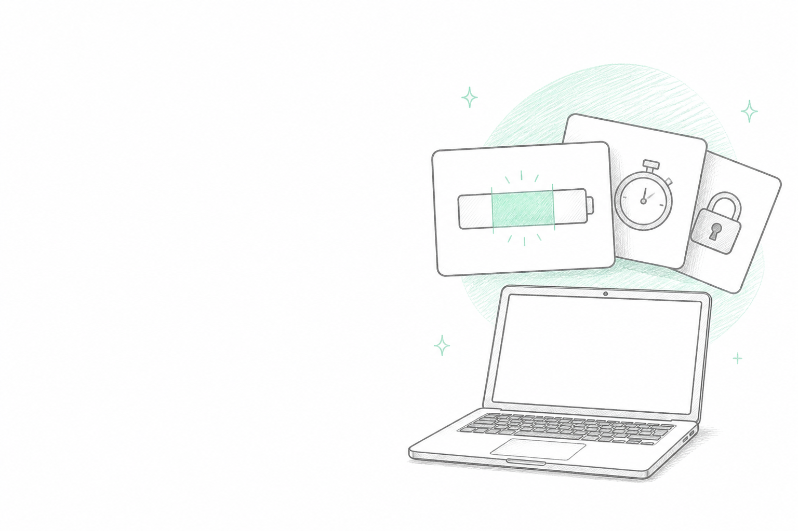<br/><sub><strong>Introduction banner in Settings</strong></sub></td>
</tr>
</table>
</div>

**Menu bar panel** — opens 8 pt *below* the menu bar as a rounded floating card (not a glued-on popover), closes on outside click or `Esc`; right-click shows a compact context menu.

- **Range gauge** — 0–100 track with red / green / orange zones, live marker and direction of flow
- **Timeline** — Deviation → Warning (once, 2:00) → Lock, active step highlighted, live countdown
- **Stats** — power source, time remaining, cycle count, battery health (`AppleSmartBattery`)
- **Capacity bar** — mAh strip under the stats: solid = charge stored now, light = what a full charge holds today, track = factory design capacity, orange tail = mAh lost to ageing (`AppleRawCurrentCapacity` / `AppleRawMaxCapacity` / `DesignCapacity`)
- Footer — Settings (`⌘,`), active rule summary (`20–80 % · 2:00`), counters, Quit

**Settings** — grouped form with a live rule preview and a clickable introduction banner at the top.

| Section | Setting | Range / default |
|---|---|---|
| Rule | Lower limit | 10 – 30 % · **20** |
| Rule | Upper limit | 70 – 95 % · **80** (band ≥ 30 points) |
| Timing | Warning → lock | 1 – 10 min in 30 s steps · **2:00** (quick picks 1:00 / 2:00 / 5:00 / 10:00) |
| Warning | Sound · Auto-open panel · Notification permission shortcut | on · on |
| Enforcement | Sleep the Mac on a lower-limit lock | off |
| General | Language · Launch at login · Show % in menu bar | System · – · on |
| Statistics | Warning / lock counters, reset | – |
| About | Developer, company and source links | – |

Changing the limits re-evaluates the current reading immediately; a new grace period applies from the next warning.

## Languages

English · Türkçe · Français · 日本語 · Deutsch. Default is **System** (follows macOS, falls back to English). Switch instantly from Settings → General → Language or from the introduction window; no restart.

Translations live in `Sources/BatteryLonger/Localization/Strings+<lang>.swift` as plain dictionaries and are read through `L("key", args…)`. To add a language: add a case to `Language`, create `Strings+xx.swift`, register it in `Localization.tables`. English is the reference table; missing keys fall back to it.

## Install

### From the DMG

Download `BatteryLonger-<version>.dmg` from [Releases](https://github.com/gurkanfikretgunak/battery-longer/releases), open it and drag the app onto the **Applications** folder the arrow points at.

<div align="center">
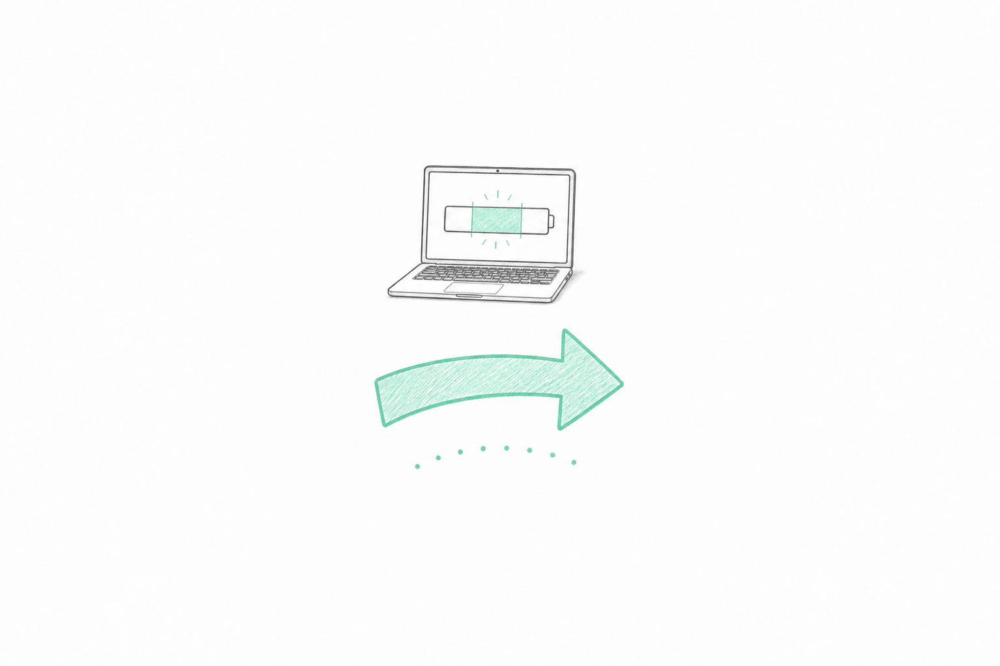
</div>

The DMG is ad-hoc signed; on first launch use right-click → *Open* (or run `xattr -dr com.apple.quarantine "/Applications/Battery Longer.app"`).

### Build it yourself

Only the **Command Line Tools** are required — no Xcode.

```bash
xcode-select --install          # once
Scripts/build_app.sh            # → dist/Battery Longer.app  (ad-hoc signed)
Scripts/make_dmg.sh             # → dist/BatteryLonger-1.0.2.dmg
open dist/BatteryLonger-1.0.2.dmg
```

The Finder window layout (`.DS_Store`) is written directly by `Scripts/dmg_layout.py` (`ds_store` + `mac_alias`, one-time venv in `dist/.dmg-tools`) — no Finder automation permission needed. `LAYOUT=finder Scripts/make_dmg.sh` uses AppleScript instead.

For distribution sign with a Developer ID and notarize:

```bash
SIGN_IDENTITY="Developer ID Application: …" Scripts/build_app.sh
xcrun notarytool submit dist/BatteryLonger-1.0.2.dmg --keychain-profile … --wait
```

## Development

```bash
swift build && swift run        # outside a bundle: notifications and login item are disabled, the rest works
```

Test the flow without waiting for the battery:

```bash
BLS_SIMULATE="85,ac"      BLS_GRACE_SECONDS=5 swift run   # overcharge  → lock after 5 s
BLS_SIMULATE="15,battery" BLS_GRACE_SECONDS=5 swift run   # deep discharge → lock after 5 s
```

`BLS_SIMULATE` replaces the real reading, `BLS_GRACE_SECONDS` shortens the grace period. To leave the lock screen during a test, hold the *Emergency exit* button for 5 seconds.

### Project layout

```
Sources/BatteryLonger/
  App/           Entry, AppDelegate, StatusBar (panel) / Blocker / Onboarding / Settings window controllers
  Core/          Policy (rule), BatterySnapshot, BatteryMonitor (IOKit), EnforcementEngine (state machine),
                 DeviceGuard (MacBook check), AppSettings, Credits
  Services/      Notifier (UNUserNotificationCenter), AppResources
  Localization/  Localization (language switching, L()), Strings+en/tr/fr/ja/de
  UI/            BatteryRangeGauge, EnforcementTimeline, CapacityBar, MenuBarView, SettingsView, OnboardingBanner,
                 BlockerView, OnboardingView, Theme
Resources/Onboarding/   sketch-01…05.png
Docs/                   README assets: app-icon-rounded.png, Screenshots/ (live app)
Packaging/              Info.plist, AppIcon-1024.png, dmg-background.png
Scripts/                build_app.sh, make_dmg.sh, dmg_layout.py
```

State machine (`EnforcementEngine`):

```
healthy ──violation──▶ warned(deadline = now + grace) ──deadline passed & still violating──▶ enforcing
   ▲                        │                                                                  │
   └──────── resolved ──────┴──────────────────────────────────────────────────────────────────┘
```

## License

[MIT](LICENSE) © 2026 MasterFabric LLC · Gürkan Fikret Günak

## Changelog

### 1.0.2 — current

- **mAh capacity bar in the menu bar panel.** Under Source / Time / Cycles / Health a new strip shows the real battery capacity: charge stored now vs. what a full charge holds today vs. factory design capacity, with the mAh lost to ageing called out (e.g. `2,589 / 4,318 mAh · Design 4,563 mAh · −245 mAh worn`). Localised in all five languages; numbers are grouped per UI language.
- Snapshots now carry `currentCapacityMAh`, `maxCapacityMAh`, `designCapacityMAh`; the simulator (`BLS_SIMULATE`) fakes them too.
- README: live app screenshots section.

### 1.0.1

Polish release for the Settings window.

- **Onboarding banner redesigned.** The introduction card in Settings is now a fixed "paper" card (cream → mint gradient) that no longer follows the system appearance, so it looks the same in light and dark mode.
- **Sketch blended into the card.** The illustration is composited with a multiply blend and a feathered left edge; the hard white rectangle that showed up in dark mode is gone and the laptop is no longer cropped.
- **Readable copy on every theme.** Banner text uses fixed ink colours instead of the adaptive label colour, so it never washes out on the light card.
- Version bump `1.0.0 → 1.0.1`.

### 1.0.0

Initial public release.

- 20–80 % rule with one warning, configurable grace period (default 2 min, up to 10 min) and full-screen lock on every display.
- Menu bar panel with battery range gauge, enforcement timeline, cycle count and health.
- Settings: thresholds, grace period, launch at login, percentage in menu bar, open panel on warning, statistics.
- Five UI languages (EN · TR · FR · JA · DE) switchable at runtime.
- Sketch-style onboarding tour, MacBook-only guard, polished drag-and-drop DMG installer.
